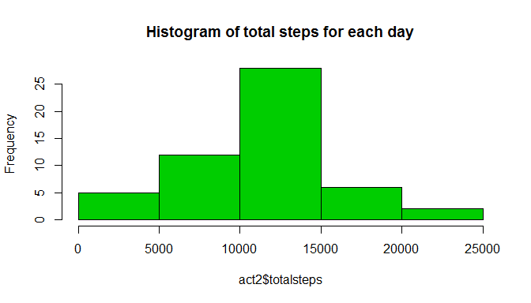

# Reproducible Research: Peer Assessment 1


## Loading and preprocessing the data

```r
unzip("./activity.zip",exdir=".")
activity<-read.csv("activity.csv")
```


## What is mean total number of steps taken per day?

```r
library(dplyr,warn.conflicts = FALSE)
act1<-group_by(activity,date)
act2<-summarise(act1,totalsteps=sum(steps))
hist(act2$totalsteps)
```

<!-- -->


## What is the average daily activity pattern?


## Imputing missing values


## Are there differences in activity patterns between weekdays and weekends?
