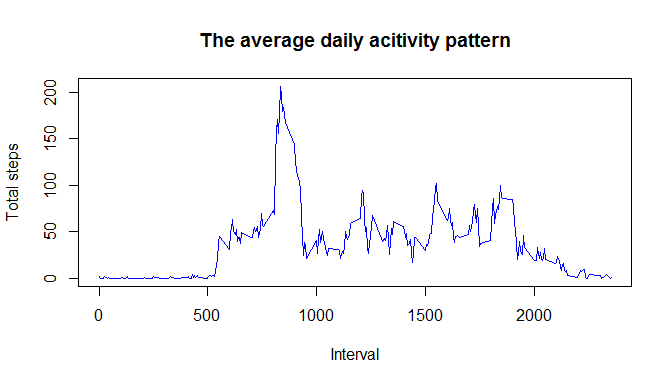
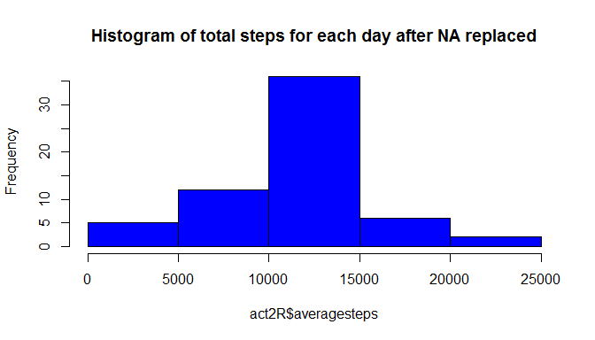

# Reproducible Research: Peer Assessment 1


## Loading and preprocessing the data

```r
unzip("./activity.zip",exdir=".")
activity<-read.csv("activity.csv")
```


## What is mean total number of steps taken per day?

```r
library(dplyr,warn.conflicts = FALSE)
act0<-filter(activity,!is.na(activity$steps))
act1<-group_by(act0,date)
act2<-summarise(act1,totalsteps=sum(steps))

hist(act2$totalsteps,col=3,main="Histogram of total steps for each day")
```

<!-- -->

```r
stepssummary<-summary(act2$totalsteps)
paste("Median : " , stepssummary["Median"], "  Mean : " ,stepssummary["Mean"])
```

```
## [1] "Median :  10760   Mean :  10770"
```


## What is the average daily activity pattern?


```r
act3<-group_by(act0,interval)
act4<-summarise(act3,averagesteps=mean(steps))


plot(act4$interval,act4$averagesteps,type="l",main="The average daily acitivity pattern",xlab="Interval",ylab="Total steps",col=4)
```

<!-- -->

```r
maxSteps<-max(act4$averagesteps)
MaxStepInterval<-filter(act4,averagesteps==maxSteps)
paste("The 5-minute interval, which  contains the maximum number of steps is ", MaxStepInterval$interval) 
```

```
## [1] "The 5-minute interval, which  contains the maximum number of steps is  835"
```


## Imputing missing values
### Using the average steps for each 5-minute interval for all days to replace missing values in the dataset, I can find no change in the value of mean, but the median changed from 10760 to 10770.
### Increasing the number of samples affected the median's change,
### On the other hand, as I used average values to fulfill the missing values, the mean of the samples is not affected.


```r
naData<-filter(activity,is.na(steps))
paste("The number of Missing data in the dataset is : ", dim(naData)[1])
```

```
## [1] "The number of Missing data in the dataset is :  2304"
```

```r
activity0<-mutate(activity,intervalf=as.factor(interval))
avgSteps<-mutate(act4,intervalf=as.factor(interval))
act5<-merge(activity0,avgSteps,by="intervalf")
act5[is.na(act5$steps),]$steps<-act5[is.na(act5$step),]$averagesteps
act5<-select(act5,- c(intervalf,interval.y,averagesteps))
act6<-arrange(act5,date,interval.x)
activityRevised<-rename(act6,interval=interval.x)


act1R<-group_by(activityRevised,date)
act2R<-summarise(act1R,averagesteps=sum(steps))

hist(act2R$averagesteps,col=4,main="Histogram of total steps for each day after NA replaced")
```

<!-- -->

```r
stepssummaryR<-summary(act2R$averagesteps)
print("statistics of the revised activity data")
```

```
## [1] "statistics of the revised activity data"
```

```r
paste("Median : " , stepssummaryR["Median"], "  Mean : " ,stepssummaryR["Mean"], "after missing values replaced")
```

```
## [1] "Median :  10770   Mean :  10770 after missing values replaced"
```


## Are there differences in activity patterns between weekdays and weekends?
### Both weekday activity and weekend activity have the peak around 800. however the weekday's peak is significantly higher thatn weekend.
### In the range from 100 to 1750, weekend's activity is higher than weekday's one. 
### In general people are walking in the morning to go to job or school among weekday, on the other hand people can go out during day time in the weekend.
### those figures should show that fact.

```r
Sys.setlocale("LC_TIME","us")
```

```
## [1] "English_United States.1252"
```

```r
acti0<-mutate(activityRevised,wday=weekdays(as.Date(activityRevised$date)))
acti1<-mutate(acti0,wend=ifelse(wday=="Saturday" | wday=="Sunday","Weekend","Weekday"))

acti2<-group_by(acti1,interval,wend)
acti3<-summarise(acti2,averagesteps=mean(steps))

library(ggplot2)

g<-ggplot(acti3,aes(interval,averagesteps))
g+geom_line() + facet_wrap(~wend, nrow = 2, ncol = 1)
```

<!-- -->


